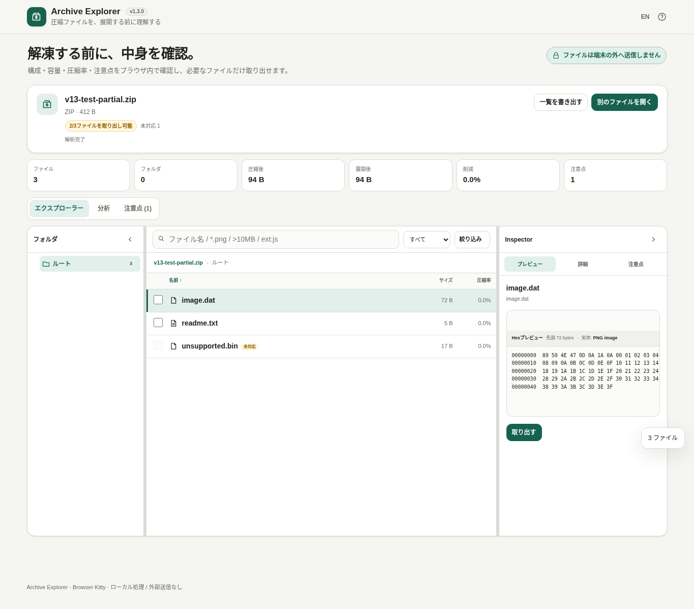

# Archive Explorer

[](https://github.com/ttomohisa/htmlapps-archive-explorer/actions/workflows/deploy-pages.yml)
[](LICENSE)
[](https://ttomohisa.github.io/htmlapps-archive-explorer/)

[English README](README.md)

ZIP・7z・RAR・TAR・GZIP・CAB・ISO・LZHなどの中身を、ファイルを外部へアップロードせずブラウザ内だけで確認・分析・取り出しできる単一HTMLアプリです。

## 🚀 デモ

### [GitHub PagesでArchive Explorerを開く](https://ttomohisa.github.io/htmlapps-archive-explorer/)

GitHub Pagesから最初のHTMLを読み込んだ後、アーカイブ解析・プレビュー・分析・パスワード処理・取り出しは端末内で実行されます。選択したアーカイブがアプリからサーバーへ送信されることはありません。

[](https://ttomohisa.github.io/htmlapps-archive-explorer/)

## 主な機能

- **展開する前に中身を探索** — フォルダ構成、ファイル名、展開後サイズ、圧縮後サイズ、圧縮率、更新日時、CRC32などをExplorer風UIで確認できます。
- **複数のアーカイブ形式をローカル解析** — ZIP / 7z / RAR5 / TAR / GZIP / CAB / ISO / LZH/LHAを、実行時CDNなしでブラウザ内解析します。
- **「どこまで扱えるか」を最初に表示** — すべて取り出し可能／一部のみ／一覧のみを上部に表示し、パスワード必要・未対応方式などの件数も確認できます。
- **必要なファイルだけプレビュー** — 画像・テキスト・コードに加え、未知のバイナリは先頭4KiBをHex + ASCIIで表示し、代表的なマジックシグネチャも判定します。
- **アーカイブ構造を可視化** — Archive Map、種類別構成、容量上位、圧縮率などから「何が容量を使っているか」を把握できます。
- **気になるファイルをすばやく発見** — `../`、絶対パス、実行ファイル／スクリプト、二重拡張子、極端な圧縮率、暗号化、入れ子アーカイブなどを検出します。
- **入れ子アーカイブへそのまま入れる** — 対応形式の中にある別アーカイブを保存せずに開き、親アーカイブへ戻れます。
- **大量ファイルでも軽快** — 大きな一覧は仮想スクロールで表示しながら、検索・ソート・フィルター・選択・キーボード操作は全件を対象に維持します。
- **必要なものだけ取り出し** — 1ファイルはそのまま保存、複数選択は新しいZIPにまとめて保存できます。
- **必要な時だけパスワード入力** — 従来方式（ZipCrypto）の暗号化ZIPは、中身が必要になった瞬間だけパスワードを求め、現在のArchiveを閉じるまでメモリ上だけに保持します。

## すぐに使う

### Webで使う

[デモを開く](https://ttomohisa.github.io/htmlapps-archive-explorer/)だけで利用できます。インストールやアカウント登録は不要です。

### 単一HTMLをダウンロードして使う

1. このリポジトリの `dist/index.html` をダウンロードします。
2. 最新のChromiumベースブラウザまたはFirefoxで開きます。
3. アーカイブをドラッグ＆ドロップするか、ファイル選択から開きます。

生成済みHTMLには実行に必要なものが含まれているため、ローカルWebサーバーは不要です。

### ローカルでビルドする

1. このリポジトリをダウンロードまたはクローンします。
2. Windowsで `build-standalone.bat` をダブルクリックします。
3. `dist/` に生成物が作成されます。
4. 通常は `dist/index.html`、より小さい形式を使いたい場合は `dist/index.self-extract.html` を開きます。

Python、Node.js、ローカルWebサーバーは不要です。ビルドにはWindows PowerShellだけを使用します。

## 使い方

1. ZIP、7z、RAR、TAR、GZIP/TGZ、CAB、ISO、LZH/LHAをドラッグ＆ドロップまたはファイル選択から追加します。
2. 上部の対応状況で「すべて取り出し可能／一部のみ／一覧のみ」を確認します。
3. 左側のフォルダツリーから階層を選び、中央のファイル一覧で確認したいファイルを選びます。
4. Inspectorで **プレビュー / 詳細 / 注意点** を切り替えます。未知のバイナリは自動でHex表示になります。
5. ファイル名・パス検索に加え、`*.png`、`ext:js`、`>10MB`、`<500KB` などでも検索できます。
6. **分析** ではArchive Map、種類別構成、容量・圧縮状況を確認できます。
7. 必要なファイルを選択して保存します。複数選択時は新しいZIPにまとめて保存します。

### 検索と絞り込みの解除

検索のサイズ条件と絞り込みの最小・最大サイズは同時に適用されます。最小サイズは大きい方、最大サイズは小さい方が使われます。境界のサイズも含むため、`>1KB` は1 KB、`<2KB` は2 KBも対象です。条件が矛盾する場合は0件になります。

検索や絞り込みで結果が0件になったときは、一覧の **検索と絞り込みをクリア** を押します。検索・種類・最小/最大サイズ・暗号化のみ・注意点ありのみを解除し、現在のフォルダ・並び順・ファイル選択は保ちます。フォーカスは検索欄へ戻ります。既存の **条件をクリア** は、引き続き詳細な絞り込み条件だけを解除します。

### 暗号化ZIP

従来方式（ZipCrypto）の暗号化ZIPは、パスワードを入力しなくても一覧を確認できます。プレビュー、Hex表示、取り出し、入れ子アーカイブを開くなど、暗号化された実データが必要になった瞬間だけパスワードダイアログを表示します。

正しいパスワードは現在開いているアーカイブのJavaScriptメモリ上だけに保持し、別のアーカイブを開くか閉じた時点で破棄します。LocalStorage、SessionStorage、IndexedDB、一覧書き出しへ保存することはありません。

AES暗号化ZIP、および7z / RARの暗号化解除はv1.0.0では未対応です。

### キーボード操作

| ショートカット | 操作 |
| --- | --- |
| `↑` / `↓` | ファイル一覧を移動 |
| `Enter` | 選択中のフォルダ／対応する入れ子アーカイブを開く |
| `Backspace` | 親フォルダ／親アーカイブ側へ戻る |
| `Space` | 選択ファイルをプレビュー |
| `Ctrl` / `⌘` + `F` | アーカイブ内検索へフォーカス |

## 対応形式

| 形式 | 一覧 | プレビュー / 取り出し | 備考 |
| --- | --- | --- | --- |
| ZIP | ○ | ○ | Stored / Deflate。従来方式（ZipCrypto）の暗号化ZIPに対応。AES暗号化、Deflate64、一部の大容量ZIP64は制限または未対応 |
| 7z | ○ | 一部 | LZMAの単一folder / solid stream。LZMA2、BCJ連結、複数folder/coder、暗号化解除は未対応 |
| RAR5 | ○ | 一部 | 無圧縮（Stored）エントリのみ。圧縮RAR5、RAR4、暗号化解除は未対応 |
| TAR | ○ | ○ | 通常TAR |
| GZIP / TAR.GZ / TGZ | ○ | ○ | TAR.GZ/TGZはGZIP層をメモリ上で展開してからTARを解析 |
| CAB | ○ | 一部 | 無圧縮CABのみ。MSZIP / LZXは未対応 |
| ISO | ○ | ○ | ISO 9660。Rock Ridgeのファイル名にも対応 |
| LZH / LHA | ○ | 一部 | level 0 / `-lh0-` のStoredエントリのみ |

7zの対応LZMA展開には、MIT Licenseの [LZMA-JS](https://github.com/LZMA-JS/LZMA-JS) のdecompression-only buildをHTMLへ内包しています。実行時CDNは使用しません。

## GitHub Pagesで公開する

このリポジトリには、単一HTMLをビルド・検証してGitHub Pagesへ自動公開するワークフローが含まれています。

1. リポジトリ名を `htmlapps-archive-explorer` としてGitHubへプッシュします。
2. **Settings → Pages → Build and deployment → Source** で **GitHub Actions** を選択します。
3. `main` ブランチへプッシュするか、Actions画面から **Deploy Archive Explorer to GitHub Pages** を手動実行します。
4. 公開後は `https://ttomohisa.github.io/htmlapps-archive-explorer/` で利用できます。

`main` へのプッシュ時にはリポジトリ検証と単一HTMLの再生成を行い、GitHub Pagesが有効なら `dist/` を公開します。

## 開発とビルド構成

```text
.
├─ src/index.template.html            # アプリ本体
├─ src/vendor/lzma-d-min.js           # 7z向けLZMA展開コード
├─ assets/                            # README用スクリーンショット
├─ dependencies.json                  # 内包依存ライブラリ情報
├─ app.config.json                    # アプリ／リポジトリ設定
├─ build-standalone.bat               # Windows用ビルド入口
├─ build-standalone.ps1               # 単一HTML / self-extract生成
├─ scripts/check-repository.ps1       # リポジトリ検証
├─ dist/index.html                    # 読みやすい単一HTML
├─ dist/index.self-extract.html       # gzip自己展開版HTML
└─ .github/workflows/
   ├─ build-standalone.yml            # Pull Request時の検証
   └─ deploy-pages.yml                # mainからPagesへ自動公開
```

ビルド処理は以下を行います。

- `src/index.template.html` から通常版の単一HTMLを生成
- HTML全体をgzip圧縮し、self-extract版へ内包
- `dist/build-size-report.json` を生成
- アプリ本体のContent Security Policyで実行時ネットワーク通信を禁止
- CIで `scripts/check-repository.ps1` による構成・生成物チェックを実行

一覧・絞り込みUIとヘッダーの回帰テストは、Node.jsで `node --test scripts/*.test.cjs` を実行します。合成したメタデータと動作を限定したDOM・描画スタブを使い、アプリの初期化やアーカイブを開く処理は実行しません。`ARCHIVE_LISTING_SOURCE=dist/index.html` または `ARCHIVE_HEADER_SOURCE=dist/index.html` を設定すると、生成した読みやすいHTMLも対応するテストで確認できます。ヘッダーのテストでは EN / JA、切り替え先のラベルとツールチップ、ローカル処理の表記、設定されたバージョンを確認します。

## プライバシーと通信防止

選択したアーカイブを端末外へ出さないことを前提に設計しています。

生成HTMLには `connect-src 'none'` を含むContent Security Policyが設定されており、アプリからアーカイブ内容やパスワードを外部APIへ送信できません。解析、プレビュー、分析、入れ子アーカイブ、パスワード確認、取り出しはブラウザ内で完結します。

パスワードは永続保存しません。完全にネットワークを切って使う場合は、生成済みの `dist/index.html` をローカルから直接開いてください。

## 制限事項

- ZIPの取り出しはStored / Deflateに対応しています。従来方式（ZipCrypto）は解除できますが、AES暗号化ZIPとDeflate64は未対応です。
- 非常に大きい、または特殊なZIP64では一部メタデータに制限があります。
- 7zはLZMAの単一folder / solid streamを対象とし、LZMA2、BCJ連結、複数folder/coder、暗号化7zの解除は未対応です。
- RARはRAR5のStoredエントリを対象とし、RAR4、圧縮RAR5、暗号化RARの解除は未対応です。
- CABは無圧縮folderのみ対応し、MSZIP / LZXは未対応です。
- LZH/LHAはlevel 0 / `-lh0-` のStoredエントリを対象とします。
- TAR.GZやsolid 7zは、個別ファイルへアクセスするために大きなストリームをメモリ上へ展開する場合があります。
- 注意点チェックはヒューリスティックであり、安全・危険を断定するものではありません。
- 巨大ファイルのプレビューや展開は、ブラウザの応答性と端末メモリを守るため意図的に上限を設けています。

## 使用ライブラリ

| ライブラリ | バージョン | ライセンス | 用途 |
| --- | ---: | --- | --- |
| LZMA-JS | 2.3.2 | MIT | 対応するLZMAベース7zの展開 |

ZIP / TAR / GZIPなどの解析、Hexプレビュー、注意点分析、仮想スクロール、UIの大部分はアプリ本体で実装しています。詳細は [THIRD_PARTY_NOTICES.md](THIRD_PARTY_NOTICES.md) を確認してください。

## ライセンス

Copyright © 2026 ttomohisa

このプロジェクトは [MIT License](LICENSE) で公開されています。
