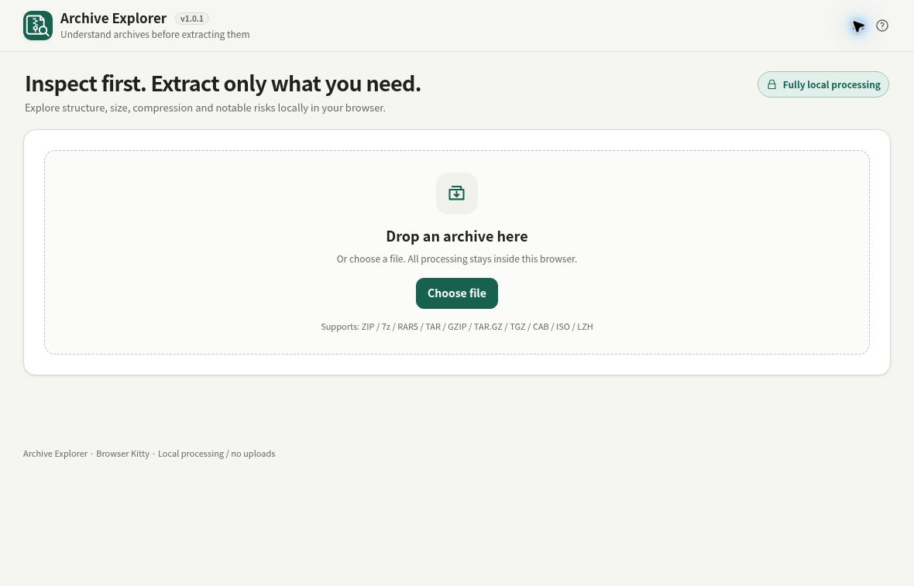

# Archive Explorer

[](https://github.com/ttomohisa/htmlapps-archive-explorer/actions/workflows/deploy-pages.yml)
[](LICENSE)
[](https://ttomohisa.github.io/htmlapps-archive-explorer/)

[日本語版 README](README.ja.md)

A privacy-focused, single-HTML archive inspector for exploring, previewing, analyzing, and extracting files from archives without uploading them to a server.

## 🚀 Live demo

### [Open Archive Explorer on GitHub Pages](https://ttomohisa.github.io/htmlapps-archive-explorer/)

GitHub Pages delivers only the initial HTML. After it loads, archive parsing, previews, analysis, password handling, and extraction are processed locally on your device. Selected archives are not uploaded by the app.

[](https://ttomohisa.github.io/htmlapps-archive-explorer/)

## Features

- **Explore archives before extracting** — Browse folders, filenames, sizes, packed sizes, ratios, timestamps, and CRC32 metadata in an Explorer-style UI.
- **Inspect many archive formats locally** — ZIP, 7z, RAR5, TAR, GZIP, CAB, ISO, and LZH/LHA are parsed in the browser with no runtime CDN.
- **See what is actually extractable** — The archive header shows whether all, some, or none of the entries can be extracted, including password-required and unsupported-method counts.
- **Preview without unpacking everything** — View images, text, code, and unknown binaries. Binary files get a 4 KiB Hex + ASCII preview with common magic-signature detection.
- **Understand archive structure visually** — Archive Map, type distribution, largest folders/items, and compression statistics help reveal where space is used.
- **Find notable entries quickly** — Detect suspicious paths, absolute paths, executables/scripts, double extensions, extreme compression ratios, encrypted entries, and nested archives.
- **Open nested archives in place** — Enter supported archives stored inside another archive and return to the parent without manually saving them first.
- **Stay responsive on large archives** — Large file lists are virtualized while search, sort, filters, selection, and keyboard navigation still operate over the full result set.
- **Extract only what you need** — Save one entry directly or package multiple selected entries into a new ZIP.
- **Ask for passwords only when needed** — Traditional ZipCrypto ZIP passwords are requested only when encrypted bytes are needed, kept only in memory for the active archive, and never saved.

## Quick start

### Use the web demo

Just [open the demo](https://ttomohisa.github.io/htmlapps-archive-explorer/). No installation or account is required.

### Use the standalone HTML

1. Download `dist/index.html` from this repository.
2. Open it in a current Chromium-based browser or Firefox.
3. Drop an archive onto the page or choose one from the file picker.

The generated HTML contains everything required at runtime and does not need a local web server.

### Build it locally

1. Download or clone this repository.
2. Double-click `build-standalone.bat` on Windows.
3. The generated files are written to `dist/`.
4. Open `dist/index.html`, or use the smaller `dist/index.self-extract.html` build when preferred.

Python, Node.js, and a local web server are not required. The builder uses Windows PowerShell only.

## Usage

1. Add a ZIP, 7z, RAR, TAR, GZIP/TGZ, CAB, ISO, or LZH/LHA archive by drag-and-drop or the file picker.
2. Check the capability status at the top to see whether all entries, only some entries, or only the file list can be handled.
3. Browse folders from the left pane and select a file in the center list.
4. Use Inspector to switch between **Preview**, **Details**, and **Notes**. Unknown binary files automatically use Hex preview.
5. Search by filename/path, or use shortcuts such as `*.png`, `ext:js`, `>10MB`, and `<500KB`.
6. Open **Analysis** to inspect Archive Map, type distribution, and size/compression summaries.
7. Select one or more extractable files and save them. Multiple selections are packaged into a new ZIP.

### Search and filter recovery

Search size shortcuts and the visible minimum/maximum size filters apply together: the higher minimum and lower maximum are used. Boundaries remain inclusive, so `>1KB` includes 1 KB and `<2KB` includes 2 KB. Conflicting bounds produce no matches.

When a search or filter leaves no matching items, choose **Clear search and filters** in the empty list. This resets the search, type, minimum/maximum size, encrypted-only and notes-only controls while keeping the current folder, sort order, and selected files. Focus returns to search. The existing **Clear filters** control still clears only the advanced filters.

### Encrypted ZIP files

Traditional ZipCrypto ZIP entries can be listed without a password. A password dialog appears only when preview, Hex view, extraction, or nested-archive opening needs the encrypted bytes.

A successfully verified password is kept only in JavaScript memory for the currently open archive. It is cleared when the archive is replaced or closed and is never written to LocalStorage, SessionStorage, IndexedDB, or an exported manifest.

AES-encrypted ZIP files and encrypted 7z/RAR extraction are not supported in v1.0.0.

### Keyboard shortcuts

| Shortcut | Action |
| --- | --- |
| `↑` / `↓` | Move through files |
| `Enter` | Open the selected folder or nested archive when available |
| `Backspace` | Move to the parent folder / archive context |
| `Space` | Preview the selected file |
| `Ctrl` / `⌘` + `F` | Focus archive search |

## Supported formats

| Format | Browsing | Preview / extraction | Notes |
| --- | --- | --- | --- |
| ZIP | Yes | Yes | Stored / Deflate. Traditional ZipCrypto is supported. AES encryption, Deflate64, and some large ZIP64 edge cases are limited or unsupported |
| 7z | Yes | Partial | LZMA single-folder / solid streams. LZMA2, BCJ chains, multiple folders/coders, and encrypted extraction are not supported |
| RAR5 | Yes | Partial | Stored entries only. Compressed RAR5, RAR4, and encrypted extraction are not supported |
| TAR | Yes | Yes | Standard TAR archives |
| GZIP / TAR.GZ / TGZ | Yes | Yes | TAR.GZ/TGZ require the GZIP layer to be decompressed in memory before TAR entries are indexed |
| CAB | Yes | Partial | Uncompressed CAB folders only. MSZIP/LZX are not supported |
| ISO | Yes | Yes | ISO 9660 with Rock Ridge filename support |
| LZH / LHA | Yes | Partial | Level 0 / `-lh0-` stored entries only |

The decompression-only build of [LZMA-JS](https://github.com/LZMA-JS/LZMA-JS) is embedded for supported 7z LZMA streams. No runtime CDN is used.

## Publish with GitHub Pages

This repository includes a workflow that builds, verifies, and deploys the standalone HTML automatically.

1. Push the repository to GitHub as `htmlapps-archive-explorer`.
2. Open **Settings → Pages → Build and deployment → Source** and select **GitHub Actions**.
3. Push to `main`, or manually run **Deploy Archive Explorer to GitHub Pages** from the Actions tab.
4. After deployment, the app is available at `https://ttomohisa.github.io/htmlapps-archive-explorer/`.

Each push to `main` runs the repository checks, rebuilds the standalone files, and publishes `dist/` when GitHub Pages is enabled.

## Development and build layout

```text
.
├─ src/index.template.html            # Main application source
├─ src/vendor/lzma-d-min.js           # Embedded 7z LZMA decompressor
├─ assets/                            # README screenshots
├─ dependencies.json                  # Bundled dependency metadata
├─ app.config.json                    # App / repository metadata
├─ build-standalone.bat               # Windows build entry point
├─ build-standalone.ps1               # Standalone + self-extract builder
├─ scripts/check-repository.ps1       # Repository validation
├─ dist/index.html                    # Readable single-HTML build
├─ dist/index.self-extract.html       # Gzip self-extracting HTML build
└─ .github/workflows/
   ├─ build-standalone.yml            # Pull request validation
   └─ deploy-pages.yml                # Automatic Pages deployment
```

The build process:

- Copies `src/index.template.html` into the readable standalone build
- Gzip-compresses the full HTML for the self-extracting variant
- Generates `dist/build-size-report.json`
- Keeps runtime network access blocked by the application's Content Security Policy
- Is validated by `scripts/check-repository.ps1` in CI

For listing/filter and header regression tests, run `node --test scripts/*.test.cjs` with Node.js. These tests use invented metadata and inert DOM/render stubs; they do not initialize the app or open archives. Set `ARCHIVE_LISTING_SOURCE=dist/index.html` or `ARCHIVE_HEADER_SOURCE=dist/index.html` to check the generated readable build with the corresponding tests. The header tests cover EN / JA targets, localized labels/tooltips, privacy wording, and the configured version.

## Privacy and runtime network protection

Archive Explorer is designed so the selected archive stays on the device.

The generated HTML includes a Content Security Policy with `connect-src 'none'`, so the application cannot send archive contents or passwords to an external API at runtime. Parsing, previews, analysis, nested-archive inspection, password verification, and extraction all happen in the browser.

Passwords are never persisted. For completely offline use, open the generated `dist/index.html` directly from local storage.

## Limitations

- ZIP extraction supports Stored and Deflate methods. Traditional ZipCrypto is supported, but AES-encrypted ZIP and Deflate64 are not.
- Very large or unusual ZIP64 archives may contain metadata cases that are only partially supported.
- 7z support targets LZMA single-folder / solid streams. LZMA2, BCJ chains, multiple folders/coders, and encrypted 7z extraction are not supported.
- RAR support targets stored RAR5 entries. RAR4, compressed RAR5, and encrypted RAR extraction are not supported.
- CAB support targets uncompressed folders; MSZIP and LZX are not supported.
- LZH/LHA support targets level 0 / `-lh0-` stored entries.
- TAR.GZ and solid 7z archives may require substantial memory because the underlying stream must be decompressed before individual entries can be accessed.
- Safety findings are heuristic indicators, not a malware verdict or guarantee of safety.
- Very large previews and decompression operations are intentionally limited to protect browser responsiveness and device memory.

## Dependencies

| Library | Version | License | Purpose |
| --- | ---: | --- | --- |
| LZMA-JS | 2.3.2 | MIT | Decompression of supported LZMA-based 7z streams |

Most archive parsing, ZIP/TAR/GZIP handling, Hex preview, safety analysis, virtualized lists, and UI behavior are implemented directly in the application. See [THIRD_PARTY_NOTICES.md](THIRD_PARTY_NOTICES.md) for details.

## License

Copyright © 2026 ttomohisa

Licensed under the [MIT License](LICENSE).
